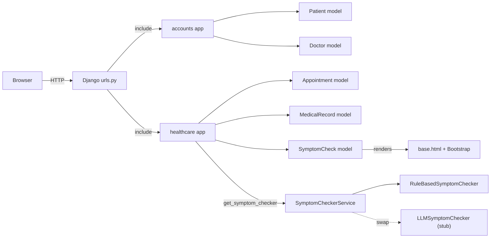
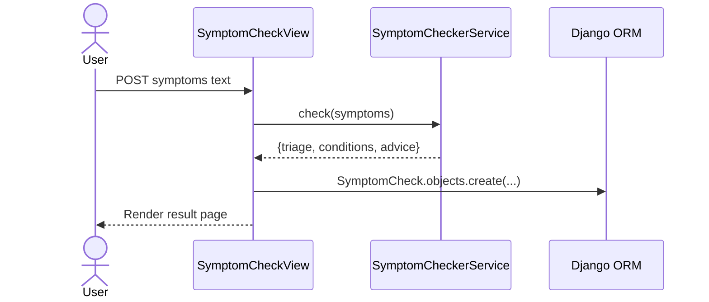
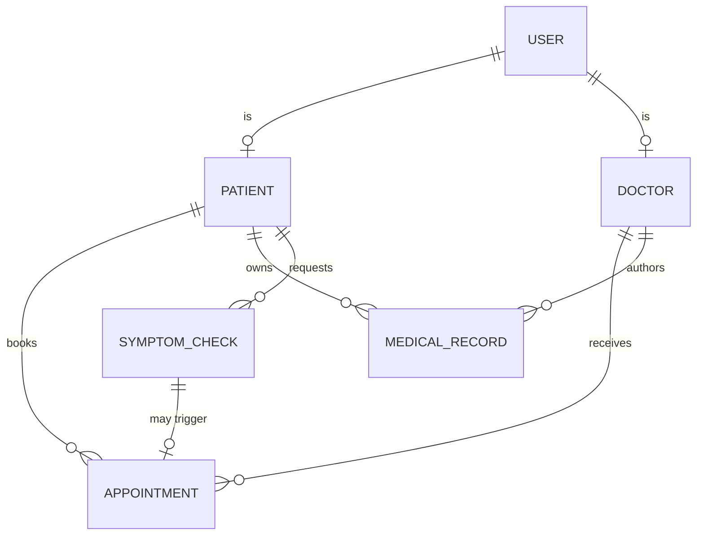

## Plan: RuralCare Django Skeleton

TL;DR: Bootstrap a Django 5 project `ruralcare` with two apps (`accounts`, `healthcare`), SQLite, Bootstrap via `django-bootstrap5` + `django-crispy-forms`, a default `User` with linked `Patient`/`Doctor` profile rows, and a pluggable AI Symptom Checker service (rule-based default with a swappable LLM backend). The plan ends with a runnable `migrate` + `runserver` setup and a demo seed script.

### Assumptions (hackathon defaults since you didn't lock these in)
- DB: SQLite (no external service to spin up for a demo).
- Auth model: default `django.contrib.auth.User` + `Patient`/`Doctor` profile models in `accounts` (1:1 to `User`). Avoids the `AUTH_USER_MODEL` migration pain during the demo.
- Bootstrap: `django-bootstrap5` + `django-crispy-forms` (crispy-pack helpers) wired through a `base.html`.
- Symptom Checker: hybrid — a `SymptomCheckerService` interface with a `RuleBasedSymptomChecker` default and an `LLMSymptomChecker` stub, selected via `settings.RURALCARE_SYMPTOM_CHECKER_BACKEND`.
- Python 3.11+ (Django 5 requires it). All commands assume Windows PowerShell in `d:\PUKU\RuralCare AI`.

### Steps
1. **Create venv and install deps** (depends on nothing)
   - `python -m venv .venv`
   - `.\.venv\Scripts\Activate.ps1`
   - `pip install "django>=5.0,<5.2" django-bootstrap5 django-crispy-forms crispy-bootstrap5`
   - `pip freeze > requirements.txt`
2. **Scaffold project + apps** (parallel with step 1's install)
   - `django-admin startproject ruralcare .`
   - `python manage.py startapp accounts`
   - `python manage.py startapp healthcare`
3. **Wire apps + third-party packages in `ruralcare/settings.py`** (depends on 2)
   - Add `accounts`, `healthcare`, `bootstrap5`, `crispy_forms` to `INSTALLED_APPS`.
   - Set `CRISPY_ALLOWED_TEMPLATE_PACKS = "bootstrap5"` and `CRISPY_TEMPLATE_PACK = "bootstrap5"`.
   - Add `AUTHENTICATION_BACKENDS` only if you go custom — not needed with default User.
   - Append `RURALCARE_SYMPTOM_CHECKER_BACKEND = "healthcare.services.rule_based.RuleBasedSymptomChecker"` to settings.
4. **Models**
   - `accounts/models.py` — `Patient(user=OneToOneField(User), date_of_birth, village, phone, created_at)`, `Doctor(user=OneToOneField(User), specialty, license_number, clinic_name, available_from, available_to)`. (parallel with 3)
   - `healthcare/models.py` — `Appointment(patient=FK(Patient), doctor=FK(Doctor), scheduled_for, reason, status=choices[pending|confirmed|completed|cancelled], created_at)`; `MedicalRecord(patient=FK(Patient), doctor=FK(Doctor) nullable, diagnosis, prescription, notes, created_at)`; `SymptomCheck(patient=FK(Patient) nullable, symptoms=TextField, result=JSONField, created_at)`.
5. **Signal in `accounts/signals.py`** to auto-create empty `Patient`/`Doctor` profile on `User` save based on a `role` marker (use `get_or_create` keyed off `user` — avoid the `AUTH_USER_MODEL` swap). Wire `ready()` in `accounts/apps.py`.
6. **Forms**
   - `accounts/forms.py` — `PatientRegistrationForm` (UserCreationForm + Patient fields) and `DoctorRegistrationForm` (UserCreationForm + Doctor fields). Use crispy helpers.
   - `healthcare/forms.py` — `AppointmentForm`, `SymptomCheckForm`.
7. **URLs**
   - `ruralcare/urls.py` — `path('accounts/', include('accounts.urls'))`, `path('healthcare/', include('healthcare.urls'))`, `path('', home_view, name='home')`.
   - `accounts/urls.py` — `/register/patient/`, `/register/doctor/`, `/login/`, `/logout/`, `/dashboard/`.
   - `healthcare/urls.py` — `/appointments/`, `/appointments/book/`, `/records/`, `/symptom-check/`.
8. **Symptom Checker service** (the hackathon centerpiece — isolated & swappable)
   - `healthcare/services/__init__.py` — exports `get_symptom_checker()` that reads `settings.RURALCARE_SYMPTOM_CHECKER_BACKEND` and `importlib.import_module` it, calling a `check(symptoms: str) -> dict` entrypoint. Returned dict shape: `{"triage": "self_care|gp|urgent", "conditions": [{"name": str, "confidence": float}], "advice": str}`.
   - `healthcare/services/rule_based.py` — `RuleBasedSymptomChecker` with a small `SYMPTOM_RULES` dict mapping keyword sets → triage/conditions/advice. Deterministic, offline, demo-safe.
   - `healthcare/services/llm.py` — `LLMSymptomChecker` stub that reads `OPENAI_API_KEY` (or similar) and returns a placeholder dict. Documented as the swap-in point.
9. **Templates + Bootstrap**
   - `templates/base.html` — loads `bootstrap5`, `crispy_forms_tags`, navbar with Home / Symptom Check / Appointments / Records / Login-Logout, and ``.
   - `templates/home.html` — hero + CTA buttons.
   - `templates/accounts/{login,register_patient,register_doctor,dashboard}.html`.
   - `templates/healthcare/{appointment_list,appointment_form,record_list,symptom_check}.html`.
   - Set `TEMPLATES[0]["DIRS"] = [BASE_DIR/"templates"]` in settings.
10. **Views**
    - `accounts/views.py` — `PatientRegisterView`, `DoctorRegisterView`, custom `LoginView`/`LogoutView` (Django auth), `DashboardView` (role-aware).
    - `healthcare/views.py` — `AppointmentListView`, `AppointmentCreateView`, `RecordListView`, `SymptomCheckView` (POSTs text to service, persists `SymptomCheck` row, renders result).
11. **Admin registrations** in `accounts/admin.py` and `healthcare/admin.py` for quick demo data entry.
12. **Seed script** `accounts/management/commands/seed_demo.py` — creates 1 doctor + 2 patients + 1 appointment + 1 sample symptom check, so the demo screen isn't empty.
13. **Migrate + smoke test** (depends on 1–12)
    - `python manage.py makemigrations accounts healthcare`
    - `python manage.py migrate`
    - `python manage.py createsuperuser`
    - `python manage.py seed_demo`
    - `python manage.py runserver` and verify: home loads with Bootstrap, register both roles, book appointment, run symptom check, see triage result.
14. **README** with setup commands, env vars (`OPENAI_API_KEY` optional for LLM backend), and a "how to swap symptom-checker backend" section.

### Relevant files
- `ruralcare/settings.py` — `INSTALLED_APPS`, `CRISPY_*`, `RURALCARE_SYMPTOM_CHECKER_BACKEND`, `TEMPLATES["DIRS"]`.
- `ruralcare/urls.py` — root router.
- `accounts/models.py`, `accounts/forms.py`, `accounts/views.py`, `accounts/urls.py`, `accounts/signals.py`, `accounts/apps.py`, `accounts/admin.py`.
- `healthcare/models.py`, `healthcare/forms.py`, `healthcare/views.py`, `healthcare/urls.py`, `healthcare/admin.py`.
- `healthcare/services/__init__.py`, `healthcare/services/rule_based.py`, `healthcare/services/llm.py`.
- `templates/base.html` and the per-page templates listed in step 9.
- `accounts/management/commands/seed_demo.py`.
- `requirements.txt`, `README.md`.

### Diagrams

**App/request flow**

**Symptom check sequence**

**Domain schema**

### Verification
1. `python manage.py check` returns no issues.
2. `python manage.py makemigrations && python manage.py migrate` apply cleanly.
3. `python manage.py runserver`, hit `/`, confirm Bootstrap navbar + hero render.
4. Register a patient at `/accounts/register/patient/` — login → dashboard shows patient info.
5. Register a doctor at `/accounts/register/doctor/` — dashboard shows doctor info.
6. Book an appointment at `/healthcare/appointments/book/` — appears in both patient and doctor lists.
7. Submit `/healthcare/symptom-check/` with `"fever, sore throat, cough"` — see `triage=gp` and a conditions list (rule-based).
8. Swap backend by setting `RURALCARE_SYMPTOM_CHECKER_BACKEND="healthcare.services.llm.LLMSymptomChecker"` in `settings.py` and re-running the check — service layer routes correctly without view changes.
9. `python manage.py seed_demo` populates demo data; admin at `/admin/` shows all rows.
